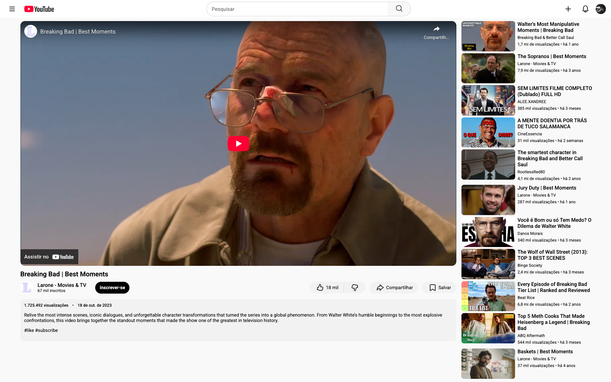

## Intro

This project is a static front-end clone of the YouTube video watch page.
The goal was to recreate the layout, structure and visual behavior of YouTube using only HTML and CSS, focusing on clean structure and accessibility.

## Tech Stack:

HTML5 and CSS3.

## Features:

    •	Fixed header with search bar
    •	Functional search input structure
    •	Video section with title, views, and publish date
    •	Action buttons (Like, Dislike, Share, Save)
    •	Channel information section
    •	Description section
    •	Recommended videos sidebar
    •	SVG icons for UI elements
    •	Accessible labels using aria-label
    •	Lazy loading for thumbnails (loading="lazy")

## Running the Project:

This is a static project, so no build tools are required.

To run it:
1. Clone the repository;
2. Open the folder;
3. Open `index.html` in your browser.

## Preview:

